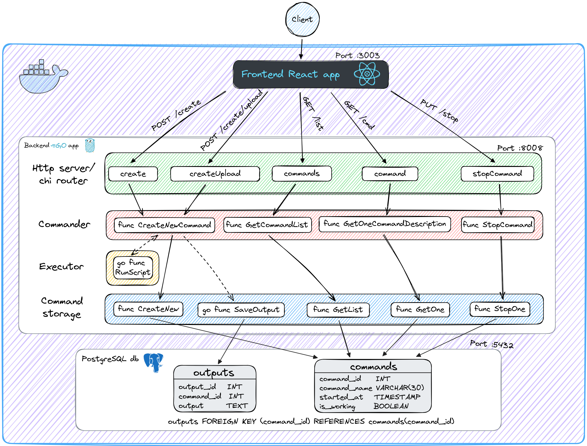

# Script Executor

It's a full-stack web application called Script Executor that lets people execute bash scripts on remote server.

## Scheme



## Features

- Backend powered by Go
- Frontend powered by React
- RESTful routing
- Backend server uses chi router
- PostgreSQL as data base
- 3 levels of logging (edit in ./back/configs/local.yaml)
- Mock tests
- Swagger API documentation
- GitHub Actions Pipeline
- [ADR](./doc/ADR.md)

## Development

Software requirements:

- Git
- Docker

To start the application use three commands:

```sh
$ git clone https://github.com/enchik0reo/script-executor

$ cd script-executor

$ docker-compose up --build
```
- Go to http://localhost:3003/ and try web app
- Go to http://localhost:8008/swagger/index.html and try swagger

To terminate service, the application uses `SIGTERM` signal (use Ctrl+C)